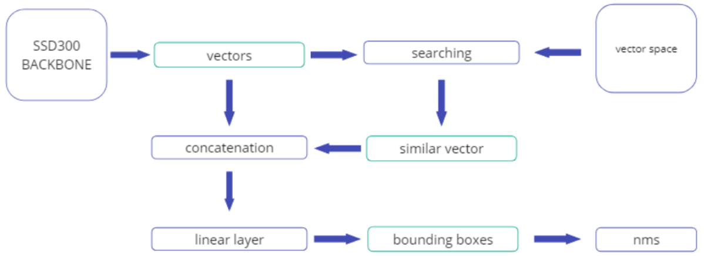
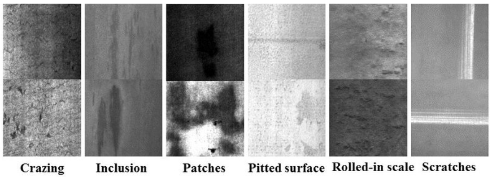
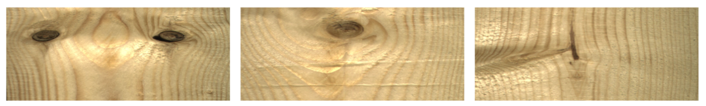
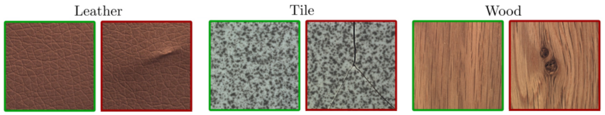

# Defects# Surface Defect Detection based on SSD Detector and Siamese Networks

## Overview
This project introduces an algorithm for zero-shot and few-shot surface defect detection, addressing the challenge of constructing a robust surface defect detector dealing with limited data cases. By combining the strengths of the SSD detector and Siamese neural networks, our approach efficiently detects defects on solid surfaces. 

## Features
- **Zero-shot and Few-shot Learning:** Capable of detecting defects with minimal training data.
- **Real-time Processing:** Efficiently processes images in real-time.
- **High Accuracy:** Demonstrates superior performance across various datasets.

## Method
Our methodology adapts the SSD300 architecture for universal defect detection. Key modifications include:
- **SSD300 Backbone:** Generates preliminary representations of potential defect locations.
- **Siamese Networks:** Enhance defect pattern recognition through a Triplet loss function.

## Experiments and Results

### Datasets
We conducted experiments using the following datasets:
- **NEU Steel Surface Defects Database**
- **Wood Defects Dataset**
- **MVTec Anomaly Detection Dataset**
- **Unseen Datasets:** Wheat leaf, Meat, Car defect, and MSWeldDefect.

#### Examples of Dataset Defects
NEU Dataset:

Wood Dataset:

MVTec Dataset:

### Training
The training involved a pre-trained SSD300 model on ImageNet, fine-tuned over 100 epochs using a weighted sum of Intersection over Union (IoU) loss and Triplet loss.

#### Model Metrics on Trained Datasets
| Dataset | 5 samples mAP50 | 10 samples mAP50 | 15 samples mAP50 | 20 samples mAP50 |
|---------|-----------------|------------------|------------------|------------------|
| MVTec   | 0.51            | 0.67             | 0.72             | 0.81             |
| NEU     | 0.62            | 0.75             | 0.84             | 0.92             |
| Wood    | 0.64            | 0.77             | 0.89             | 0.91             |

### Performance Evaluation
The model demonstrated varying performance depending on the dataset and number of templates provided, showing exceptional accuracy in detecting defects on the NEU dataset.

### Cross-Dataset Testing
| Test Dataset | Result Accuracy |
|--------------|-----------------|
| Wheat leaf   | 0.68            |
| Meat         | 0.99            |
| Car defect   | 1.0             |
| MSWeldDefect | 1.0             |

The model maintains real-time processing capabilities across various template quantities, tested on an RTX 3090.

### Comparative Analysis
| Model          | Real-time | Zero-shot | Multi-class Detection |
|----------------|-----------|-----------|-----------------------|
| FCSNN [9]      | +         | –         | –                     |
| ConvEnsembling [10] | +   | –         | +                     |
| CombAttention [11] | –     | –         | +                     |
| SBFN [12]      | +         | –         | +                     |
| RandNet [13]   | +         | –         | +                     |
| HPR [14]       | –         | +         | –                     |
| **SSD300+Siamese** | +     | +         | +                     |
